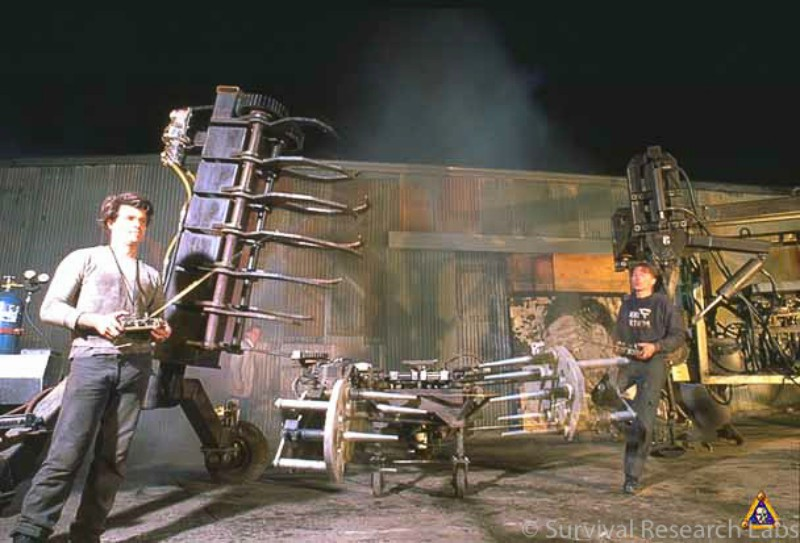

### More Information

#### History

- Tinkered with electronics and building stuff from a young age
- Studied electrical engineering
- Worked for many years designing hardware and software
  - Digital Microsystems (Networked CP/M computers)
	- TFS and then TRW (high speed image processing)
	- Wind River Systems (Real-time embedded operating system)
	- Etc.

#### Art Background

- As a child, my tinkering was never oriented towards practical devices. I was
	more interested in experimenting with parts and concepts. 
- This continued
	when I became a professional engineer: While working on practical consumer
	and industrial projects, I would hear about interesting new components and
	think about what wacky impractical things I could do with them.
- But I didn't know what to do with this interest.
- Shortly after college I stumbled into an SRL show (large scale machine art
	performance).	
	
	I didn't know what it
	was, but I was changed. I realized that there was a place for my
	interest in technology that didn't involve building practical products.
	I fantasized about doing this sort of art.
- (Google "Survival Research Labs" images for tons more)
- Not knowing how to connect with SRL, but inspired to make art, I bought a
	welder and started making non-mechanized contraptions, mostly 
	seemingly impractical furniture
- A few year later (1994 or so) I met someone who worked with SRL, and she
	told me that I could simply come down to the workshop and start working.
	I've been working with SRL since, and have worked on some 20 shows around
	the world with them. 
- Through SRL I also worked with other groups and individuals, some working in
	similar areas, and others in quite different areas.

#### Teaching

- One of my friends at SRL taught a
	[class](http://interfacef11.pbworks.com/w/page/44486076/Interface) at the California College of the
	Arts on making art using technology. They needed a way to interface
	sensors and actuators to a computer, so some friends and I formed a company
	(MakingThings) to build such a thing. 
- As part of training students to 
	use this system, I became involved in teaching at CCA
	and I discovered that I loved teaching (and was told that I
	wasn't bad at it) and started transitioning to a new career as an educator
- I taught at CCA, The Crucible, San Francisco Art Institute, San Francisco
	State University, and at UC Berkeley.
- I now teach at New York University in Abu Dhabi, where my focus is on
	physical computing
  Associate Professor of Practice of Interactive Media

##### Arduino

- Arduino at Maker Fairs
- Getting Started with Arduino 3rd Edition
- Education and Community

### My Work

#### Machine Art

- Rolling Ball

- Meditations on Motion

#### Conceptual Pieces

- Communication

#### Classes at NYU:
- Intro to IM
- Performing Robots
- Machine Lab
- Network Everything

#### Other Interests

- Open Source Software
	- Visible design

- What can art students and other creatives bring to areas where they aren't
	usually involved, e.g. engineering and computer science
	- Telepresence
	- Inflatable Robotics

- "Maker" community

- Rapid prototyping

- Improving construction techniques

- Generating experimental sounds using programming e.g. 
  - Sonic Pi
	- Beagle hat from Queens College
	- [Adafruit Music Maker](https://www.adafruit.com/product/1788)

#### Rants

- Digital Fabrication tools

- LEDs

- AI

### Contact me

[michael@michaelshiloh.com](mailto:michael@michaelshiloh.com)  
[mshiloh@nyu.edu](mailto:mshiloh@nyu.edu)  
[m@shiloh.io](mailto:m@shiloh.io)  
